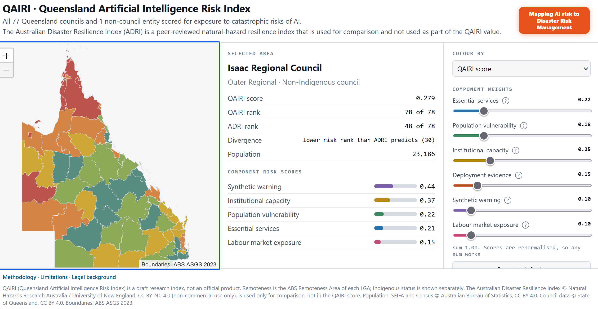

# QAIRI: Queensland Artificial Intelligence Risk Index

Mangrove Hackathon, 28–30 August 2026. Team: Julie and Paul.

## The question

Australia has a government-published, peer-reviewed index of which communities absorb shocks
badly, the Australian Disaster Resilience Index (ADRI), built for bushfires and floods. Every
catastrophic AI scenario in the international safety literature lands through the same
channels: essential services, warning systems, institutional capacity. **Are the communities
already known to be least resilient the ones with the most to lose from AI risk, and has
anyone checked?**

## Key findings

- **The councils Australia's own natural-disaster index rates as most resilient are, on this
  measure, some of the most exposed.** Townsville, Brisbane, Sunshine Coast and Moreton Bay all
  rank 50 or more places worse here than their official disaster-resilience ranking would
  predict. Relying heavily on digital systems is a strength against floods and cyclones; it's a
  weakness if the system itself fails. Nobody had measured that trade-off before.
- **The communities already known to cope worst with natural disasters carry a second, separate
  risk nobody has checked.** Doomadgee, Aurukun, Torres Strait Island and Kowanyama already rank
  among Queensland's least resilient to floods and cyclones. They also rank among the most
  exposed here, but for different reasons entirely (unregulated water and power supply, thin
  council budgets, not digitisation). Two different risks, same communities, not previously
  connected.
- **Queensland law already covers this, nobody has applied it to AI yet.** If a basic service
  like water or power fails, state law already treats that as a disaster a council is
  responsible for handling, whatever the cause. Councils are also already required by law to
  consider people's rights before making decisions that affect them. Neither rule mentions AI.
  Both already apply to it.

## The method

**Borrow ADRI's architecture, swap the hazard.** ADRI doesn't measure "how much bushfire is
coming", it measures whether a community can absorb a shock and adapt afterwards. That
structure is hazard-agnostic and transfers directly. What doesn't transfer is the hazard model
itself, which this project had to build from scratch.

**Don't invent a risk list, cite one.** The categories come from the *International AI Safety
Report 2026* (Bengio et al.), malicious use, malfunctions, systemic risks, with the *Overview
of Catastrophic AI Risks* (Hendrycks, Mazeika & Woodside) as a finer-grained second reference.
A specific hazard only earns a place in the index if it passes four tests: it traces to one of
those categories, a council controls or is exposed through a local channel, real data exists
that differs council to council, and a council can actually act on it.

**Score every hazard as three separate terms**, not one number: exposure (does it reach you),
absorptive capacity (can you contain it locally), consequence (how bad if it lands). Collapsing
these into one number hides real effects, remoteness protects against some hazards and
worsens others; a highly digitised metro council can be *more* institutionally exposed than a
paper-based shire, not less.

**Hold ADRI out as the control.** The index never uses ADRI's own scores as an input, only as
a check afterwards. If the two rankings turned out to be near-identical, the honest finding
would be "we rebuilt ADRI and added nothing." They diverge (Spearman r = −0.408, well below the
0.9 threshold that would mean the index adds nothing), which is reported as the actual result,
not hidden in favour of a cleaner story.

## What's built

**All six components are live** in `config/index.yaml` and `data/qld_lga_index.csv`, weighted
22/18/25/15/10/10.

| Component | Weight | Bengio category | What it measures |
|---|---|---|---|
| Essential services | 22% | Malicious use / Malfunctions | Water/sewerage self-provision below the regulated critical-infrastructure threshold, isolated (non-grid-connected) electricity networks, remoteness (days to restore) |
| Population vulnerability | 18% | Cross-cutting | Disadvantage (SEIFA), crowding, Indigenous share, who absorbs a shock badly, hazard-agnostic |
| Institutional capacity | 25% | Malfunctions | Discretionary revenue, staffing depth and mix, can the council itself keep functioning |
| Deployment evidence | 15% | AI race (Hendrycks) | Confirmed AI use, press-derived |
| Synthetic warning | 10% | Malicious use | Fabricated, AI-generated evacuation message during a live emergency, with no second channel to check it against, the only component whose scored factor genuinely depends on AI as the cause. Built from disaster-event frequency, funded mobile coverage (channel redundancy) and non-English-speaking household share (does the official channel actually reach everyone) |
| Systemic labour | 10% | Systemic risk | Share of employed persons in occupations most exposed to generative AI (Professionals, Clerical and Administrative, Sales, Census 2021, ABS). The only component addressing Bengio's third category, which was otherwise absent from the index entirely |

**A genuine, notable tension surfaced by adding systemic labour:** this component pulls in the
*opposite* direction from the rest of the index. AI-exposed occupations (professional, clerical,
sales) are concentrated in wealthy, high-capacity metro councils, the same councils that score
*well* on ADRI. So this component, scored as "more exposure = more risk," actually correlates
*positively* with ADRI resilience, dragging the overall correlation toward zero (a large part of
why it moved from −0.533 to −0.331 once this was added; a later swap to a more authoritative
disaster-frequency source, below, moved it again to −0.408). This is the same pattern already flagged
for `indoor_staff_share` in institutional capacity, a "digitisation" variable that could
plausibly point either way depending on whether it's read as exposure or as capacity. Worth
naming directly rather than left for a judge to spot: is a high AI-exposed-occupation share a
risk (more jobs an AI could disrupt) or a proxy for capacity (a well-resourced local economy)?
The index currently assumes the former. That assumption is arguable, not settled.

**Disaster frequency now comes from Queensland Reconstruction Authority activation records**,
not the earlier geocoded events catalogue. Every council's Disaster Recovery Funding
Arrangements activation since 2010–11 is filterable by name on QRA's own site, and the previous
approximation (which missed Cyclone Jasper at Wujal Wujal and Cyclone Kirrily entirely) is
retired. See `research/qra_activations_by_lga.csv`.

**Against Hendrycks' four categories** (malicious use, AI race, organisational risk, rogue AI):
essential services, synthetic warning and institutional capacity fall under malicious use and
organisational risk; deployment evidence is the closest fit for AI race (competitive pressure to
deploy); rogue AI is deliberately not represented, it requires a level of system autonomy
nothing in this dataset has, and pretending otherwise would be dishonest. Full column-by-column
mapping against both taxonomies, including the 43 collected variables not currently scored:
`TAXONOMY-MAP.md`.

Synthetic warning deliberately does not use `adri_information_access` as a channel-access proxy,
even though it's the closest-fitting ADRI theme, that column is held out as the control, and
using it here would leak the control into the model. It also deliberately excludes remoteness:
the project's own analysis found remoteness genuinely ambiguous for this hazard (a short local
verification chain cuts one way, thin channel coverage cuts the other), not a defensible single
direction.

**Why these weights.** Institutional capacity carries the most weight because it's the
component with the least analogue in ADRI, the independent signal this index can actually add.
Deployment evidence, synthetic warning and systemic labour are deliberately the three lowest
weights, and deliberately not all equal: all three rest on thinner evidence than the first three
components (press-derived AI-usage reports; official but incomplete channel-coverage and language
data; a single occupational-exposure proxy never cross-checked against a second index), but
synthetic warning and systemic labour's data is thinner still, so they carry less weight than
deployment evidence, not the same amount. Together the three lowest-confidence components hold
35% of the index, not 70%, reliability comes from keeping the weakest evidence from dominating
the result, not from excluding it. These are expert-judgement weights, not fitted ones; the
interactive map's sliders exist so a reader can test whether the ranking survives a different
weighting, which is the sensitivity check a fixed number can't show on its own.

**The legal case for why this is a council's problem, not a hypothetical one:**

- Queensland's *Disaster Management Act 2003* already makes local government primarily
  responsible for "events" in its area (s4A(d)), and already defines a failure of essential
  service or infrastructure as a qualifying event (s16(1)(d)). An AI-caused infrastructure
  failure plausibly falls inside an existing duty, not a new one.
- The *Human Rights Act 2019* (Qld) already requires councils, as core public entities, to give
  demonstrable consideration to human rights when making a decision (ss9, 58), nobody currently
  applies this to automated systems.
- The *Local Government Act 2009* (Qld) general competence power (ss9, 262) already lets a
  council act on this, commission an audit, adopt a policy, without waiting for AI-specific
  legislation.

An interactive map (`docs/map/`) lets a reader recompute the index live with different
component weights, the weights are the argument, not a fixed truth, and the map is built so
that's visible rather than hidden. The map also carries an "About this index" panel with the
resilience model below.

**What to do about it isn't a new framework, it's Queensland's existing one.** The
*International AI Safety Report 2026* proposes a four-stage resilience model, Resist, Absorb,
Recover, Adapt, for harms a developer can't directly control. It maps directly onto the
Disaster Management Act 2003's own four-phase cycle:

| Report (Bengio) | DMA 2003 (Qld) |
|---|---|
| Resist | Prevention |
| Absorb | Preparation |
| Recover | Response |
| Adapt | Recovery |

The point of showing them side by side: a council doesn't need a new discipline for AI-risk
resilience, it's the same shape as the disaster planning every council already does under s30.

## What this doesn't claim

The full account, written as its own page rather than a footnote, is **[`docs/limitations.html`](docs/limitations.html)**. Headlines:

- Most of the index measures general vulnerability, not an AI-specific mechanism, it would
  score similarly for a natural disaster. Of the six components, synthetic warning is the one
  genuinely specific to AI as the cause.
- Systemic labour pulls in the *opposite* direction from the rest of the index, AI-exposed
  occupations concentrate in the same wealthy, high-capacity councils ADRI already scores as
  resilient, which is a large part of why the overall correlation moved toward zero once it was
  added, not away from it.
- `Pabai v Commonwealth (2025)`, the Federal Court declined to find the Commonwealth owed a
  duty of care to Torres Strait Islanders over climate-change harm. A real negative precedent
  against the idea that government already owes an affirmative duty here; addressed directly
  rather than left for a judge to raise.
- Rogue AI (Hendrycks) is deliberately not represented, nothing in this dataset has the
  autonomous capability the category actually describes, and inventing a proxy for it would be
  dishonest.
- Full source list, data provenance, and everything still open, `HANDOVER.md` and `ACTIONS.md`.

## In this repo

| Folder | What's in it |
|---|---|
| `docs/` | The full write-up (`ai-disaster-resilience-index.html`), the limitations page (`limitations.html`), the legal background (`qld-council-governance.html`), and the live map (`map/`) |
| `code/` | The pipeline, `fetch_adri.py` → `build_councils.py` → `fetch_lga_profile.py` → `fetch_mbsp.py` → `build_master.py` → `build_index.py` |
| `data/` | ADRI 2024 by LGA, the 78-council register, the merged master table, the scored index |
| `research/` | Raw source material, including the disaster-events-by-council data behind synthetic warning |

**The interactive map explains itself.** Every slider carries a small "?" button, opening a
plain-language explanation of what that component measures and, where it's built from more than
one input, exactly how much weight each one carries. Built on the assumption that this is a tool
for council staff, not just researchers, so nothing in it should require already knowing what
SEIFA or SOCI or ADRI mean.

**Attribution required:** the ADRI data in `data/` is Australian Disaster Resilience Index,
Natural Hazards Research Australia / University of New England, licensed CC BY-NC 4.0.
Non-commercial use only, attribution must be displayed.

---

## Attribution

This repository redistributes and builds on third-party open data. Attribution is a licence
condition, not a courtesy.

| Data | Attribute to | Licence |
|---|---|---|
| Australian Disaster Resilience Index (`data/adri_*`, and the `adri_*` columns in `data/lga_profile_QLD.csv` and `data/councils.csv`) | **Natural Hazards Research Australia** and the **University of New England** | **CC BY-NC 4.0, non-commercial use only** |
| Population, SEIFA and Census (`data/lga_profile_QLD.csv`) | **Australian Bureau of Statistics** | CC BY 4.0 |
| Council staff, finances and water connections | **State of Queensland** (Department of Local Government, Water and Volunteers) | CC BY 4.0 |

The ADRI licence is the binding one: **non-commercial use only**, attribution displayed.
Anything published from this work must carry the NHRA/UNE credit on the page itself.

Data currency varies, see [`data/DATA_DICTIONARY.md`](data/DATA_DICTIONARY.md). ABS and ADRI
columns are current; Queensland council columns are 2015–16.
